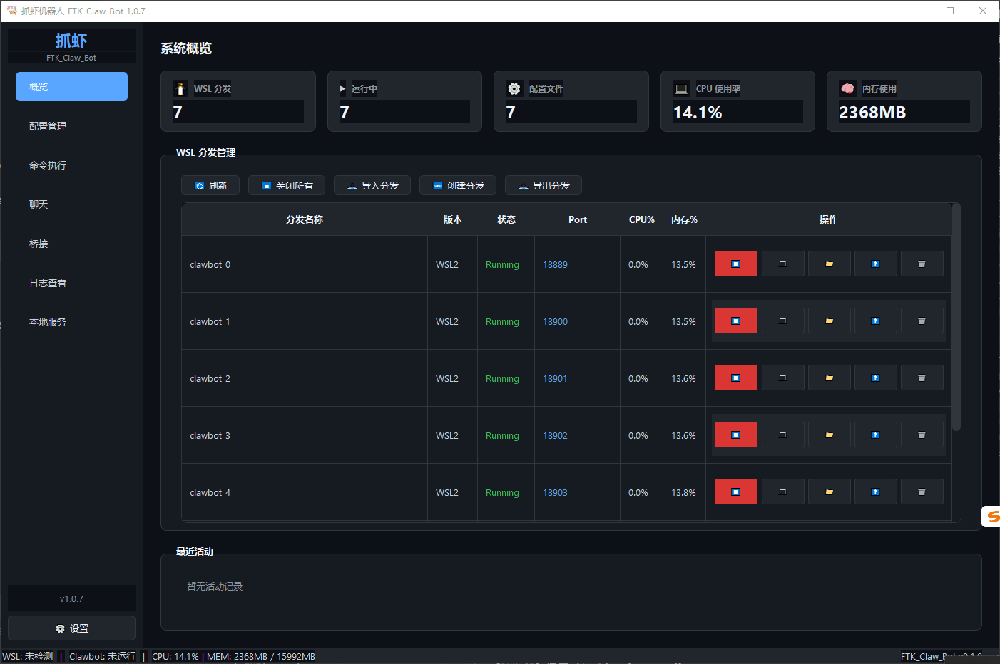

[English](README_en.md) | [简体中文](README.md)

# FTK_Claw_Bot - Claw Bot

FTK_Claw_Bot - A Windows-based swarm control tool, an openclaw alternative solution. Focused on bot management and control in WSL2 environment, supporting multiple bot instances running in parallel on a single machine and bot group chat. Provides complete Windows system operation bridging (mouse/keyboard/screenshot/window/clipboard), modern PyQt6 graphical interface, plugin system for unlimited extension, and WSL2 bridge proxy for cross-system collaboration.

## ✨ Features
<div align="center">

</div>

### 🔧 Core Features

| Feature Module | Description |
|---------|------|
| **WSL2 Management** | Manage WSL2 distributions (start/stop/import/remove/export), real-time resource monitoring (CPU/memory/disk), IP address retrieval, terminal access |
| **Bot Control** | Start, stop, restart bot instances, support multiple bots running in parallel on a single machine, real-time status monitoring, log viewing and filtering |
| **Configuration Management** | Visual configuration editing, multi-configuration management, default configuration settings, workspace synchronization, cross-platform path conversion |
| **Skill Management** | Create/edit/delete skills, import/export skill packages, real-time search, Markdown editor integration |
| **Windows Bridge** | Mouse control, keyboard simulation, screen capture, window finding and control, application launch, clipboard synchronization |
| **Chat Panel** | WebSocket connection to Clawbot Gateway, multi-bot group chat support, message forwarding |
| **Embedding Service** | Text vectorization service (Qwen3-Embedding-0.6B), supports semantic similarity calculation, ONNX inference acceleration |

### 🎨 UI Features

- **Modern GUI**: Responsive design, dark theme, system tray integration
- **Multi-panel Layout**: Overview, configuration management, command execution, chat, bridge, log viewing
- **Real-time Monitoring**: WSL resource monitoring, Bot status monitoring, system tray notifications
- **Keyboard Shortcuts**: Quick navigation and operation

### 🔌 Extension Features

- **Plugin System**: Modular plugin architecture, dynamic loading, lifecycle management, configuration persistence
- **WSL2 Bridge Proxy**: Socket communication, request forwarding, cross-system collaboration
- **Event Bus**: Decoupled communication between components, supports subscribe/publish pattern

## 📋 System Requirements

| Requirement | Description |
|------|------|
| Operating System | Windows 10 2004+ or Windows 11 |
| WSL | WSL2 installed and configured |
| Python | Python 3.10+ |
| Memory | At least 4GB available memory (8GB+ recommended when enabling Embedding service) |

## 🚀 Installation

### Install from Source

```bash
# Clone repository
git clone https://github.com/zeusftk/FTK_Claw_Bot.git
cd FTK_Claw_Bot

# Method 1:
pip install -r requirements.txt
## 🏃 Run
python -m ftk_claw_bot.main

# Method 2:
pip install -e .
## 🏃 Run
ftkclawbot
```


### Use Binary Package Directly
Suitable for users without Python environment, ready to use out of the box:
1. Download `init_wsl` and `FTK_Claw_Bot_x.x.x.exe`
2. Double-click to run `FTK_Claw_Bot_x.x.x.exe`

> **Note**: For first-time run, use `wsl --version` to check WSL version and ensure it is WSL2.

## 🔧 Complete WSL Version Check and Auto Upgrade
```bash
cd init_wsl
check_wsl_version.bat
```


## 📁 Project Structure

```
FTK_Claw_Bot/
├── ftk_claw_bot/
│   ├── bridge/               # WSL2 bridge protocol
│   │   ├── __init__.py
│   │   └── protocol.py
│   ├── core/                 # Core business logic
│   │   ├── bridge_manager.py           # Bridge manager
│   │   ├── config_manager.py           # Configuration manager
│   │   ├── config_sync_manager.py      # Config sync manager
│   │   ├── multi_nanobot_gateway_manager.py  # Multi-Bot gateway manager
│   │   ├── nanobot_controller.py       # Bot controller
│   │   ├── nanobot_gateway_manager.py  # Gateway manager
│   │   ├── port_manager.py             # Port manager
│   │   ├── skill_manager.py            # Skill manager
│   │   └── wsl_manager.py              # WSL manager
│   ├── gui/                  # GUI interface
│   │   ├── dialogs/          # Dialog components
│   │   │   ├── create_distro_wizard.py # Create distribution wizard
│   │   │   ├── message_dialog.py       # Message dialog
│   │   │   ├── settings_dialog.py      # Settings dialog
│   │   │   ├── skill_editor.py         # Skill editor
│   │   │   └── waiting_dialog.py       # Waiting dialog
│   │   ├── mixins/           # Mixin classes
│   │   ├── resources/        # Resource files
│   │   ├── widgets/          # Widgets
│   │   │   ├── channel_config_dialog.py # Channel config
│   │   │   ├── chat_panel.py           # Chat panel
│   │   │   ├── command_panel.py        # Command panel
│   │   │   ├── config_panel.py         # Config panel
│   │   │   ├── local_services_panel.py # Local services panel
│   │   │   ├── log_panel.py            # Log panel
│   │   │   ├── overview_panel.py       # Overview panel
│   │   │   ├── skills_config_widget.py # Skills config widget
│   │   │   ├── splash_screen.py        # Splash screen
│   │   │   └── windows_bridge_panel.py # Bridge panel
│   │   ├── main_window.py    # Main window
│   │   └── styles.py         # Style definitions
│   ├── interfaces/           # Abstract interfaces
│   │   ├── config.py         # Config interface
│   │   ├── controller.py     # Controller interface
│   │   └── wsl.py            # WSL interface
│   ├── models/               # Data models
│   │   ├── channel_config.py # Channel config model
│   │   ├── nanobot_config.py # Bot config model
│   │   ├── skill.py          # Skill model
│   │   ├── skill_config.py   # Skill config model
│   │   └── wsl_distro.py     # WSL distribution model
│   ├── plugins/              # Plugin system
│   │   ├── base.py           # Plugin base class
│   │   └── manager.py        # Plugin manager
│   ├── resources/            # Resource files
│   │   └── models/           # AI model files
│   │       └── Qwen3-Embedding-0.6B-ONNX/  # Embedding model
│   ├── services/             # Service layer
│   │   ├── embedding/        # Embedding service
│   │   │   ├── embedder.py   # Model inference
│   │   │   ├── server.py     # FastAPI service
│   │   │   └── service.py    # Service management
│   │   ├── ipc_server.py     # IPC server
│   │   ├── monitor_service.py # Monitor service
│   │   ├── nanobot_chat_client.py # Chat client
│   │   ├── service_registry.py # Service registry
│   │   ├── windows_bridge.py # Windows bridge
│   │   ├── wsl_initializer.py # WSL initialization service
│   │   └── wsl_state_service.py # WSL state service
│   ├── utils/                # Utility functions
│   │   ├── async_ops.py      # Async operations
│   │   ├── logger.py         # Logger utility
│   │   ├── path_converter.py # Path converter
│   │   ├── path_utils.py     # Path utilities
│   │   ├── performance.py    # Performance tools
│   │   ├── thread_safe.py    # Thread safety
│   │   └── validators.py     # Validators
│   ├── app.py                # Application class
│   ├── constants.py          # Constants definition
│   ├── container.py          # Dependency injection container
│   ├── events.py             # Event bus
│   └── main.py               # Application entry
├── init_wsl/                 # WSL initialization scripts
│   ├── check_wsl_version.bat # WSL version check script
│   └── nanobot-0.1.4.3-py3-none-any.whl # nanobot wheel package
├── requirements.txt          # Dependencies list
├── setup.py                  # Installation config
└── pyproject.toml            # Project config
```

## 🛠 Tech Stack

| Category | Technology |
|------|------|
| GUI Framework | PyQt6 |
| System Operations | pyautogui, pywinauto |
| Web Framework | FastAPI, Uvicorn |
| AI Inference | ONNX Runtime|


## ⌨️ Keyboard Shortcuts

| Shortcut | Function |
|--------|------|
| `Ctrl+1` | Switch to Overview panel |
| `Ctrl+2` | Switch to Configuration panel |
| `Ctrl+3` | Switch to Command panel |
| `Ctrl+4` | Switch to Chat panel |
| `Ctrl+5` | Switch to Bridge panel |
| `Ctrl+6` | Switch to Log panel |
| `Ctrl+S` | Save current configuration |
| `Ctrl+F` | Focus search |
| `Esc` | Cancel focus |


## 📊 Default Ports

| Service | Port | Description |
|------|------|------|
| IPC Bridge | 9527 | Inter-process communication bridge |
| Gateway | 18888 | Clawbot Gateway |
| Embedding | 8765 | Text vectorization service |


## 📜 Version History

| Version | Date | Changes |
|------|------|----------|
| 1.0.6 | 2026-02-23 | Added GUI logo, fixed I18nManager signal issue, updated nanobot wheel |
| 1.0.5 | 2026-02-23 | Added Embedding service, supports text vectorization |
| 1.0.4 | 2026-02-21 | Updated nanobot wheel to 0.1.4.1, project structure optimization |
| 1.0.3 | 2026-02-20 | Documentation sync update, directory structure optimization |
| 1.0.2 | 2026-02-18 | Layout optimization, default provider adjustment, progress dialog fix |
| 1.0.1 | 2026-02-17 | Unified version management, plugin system, naming convention documentation |
| 1.0.0 | 2026-02-14 | Initial version |

## 📄 License

[MIT License](LICENSE)

## 🤝 Contributing

Issues and Pull Requests are welcome!

## 📧 Contact

- **Author**: FTK Team
- **Email**: zeusftk@gmail.com
- **GitHub**: [https://github.com/zeusftk/FTK_Claw_Bot](https://github.com/zeusftk/FTK_Claw_Bot)
